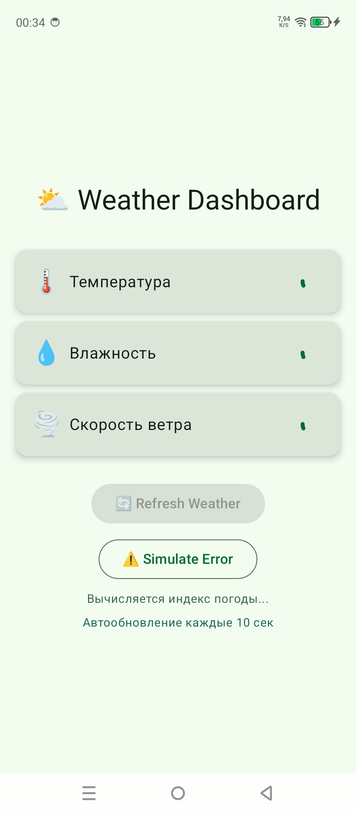
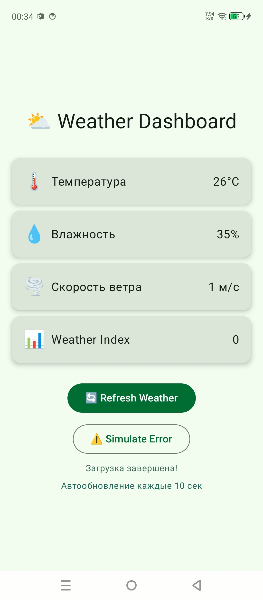
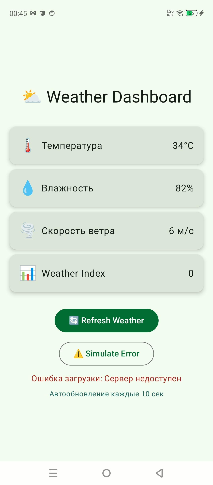

# Weather Dashboard

Приложение на Android, которое показывает погодные данные из трёх источников с имитацией загрузки из сети

Данные загружаются параллельно с помощью корутин Kotlin, что делает приложение быстрым и не блокирует UI-поток

## Функциональность

- Отображение температуры, влажности и скорости ветра
- Параллельная загрузка данных с помощью async/await (~2 сек вместо ~4.5 сек)
- Индикатор загрузки для каждой карточки
- Текстовый прогресс загрузки
- Вычисление Weather Index на Dispatchers.Default
- Автообновление данных каждые 10 секунд
- Имитация ошибки сервера для тестирования обработки ошибок
- Кнопка ручного обновления

## Технологии

- Kotlin
- Jetpack Compose
- Coroutines (kotlinx-coroutines-android, kotlinx-coroutines-core)
- ViewModel + StateFlow
- lifecycle-viewmodel-compose
- Material 3

## Контрольные вопросы

### A) В чём разница между launch и async?

`launch` запускает корутину и не возвращает результат (возвращает Job) - используется когда результат не нужен

`async` запускает корутину и возвращает Deferred - используется когда нужно получить результат через `await()`

```kotlin
viewModelScope.launch {
    loadData()
}

val result = viewModelScope.async {
    fetchTemperature()
}.await()
```

### B) Что такое suspend функция?

Suspend функция - это функция, которая может приостановить выполнение корутины не блокируя поток

Из обычной функции вызвать нельзя - только из корутины или другой suspend функции

`delay()` не блокирует поток потому что это suspend функция - она просто приостанавливает корутину и освобождает поток для других задач, в отличие от `Thread.sleep()` который блокирует поток полностью

### C) Зачем нужны разные диспетчеры?

| Диспетчер | Когда использовать | Пример |
|---|---|---|
| Dispatchers.Main | Обновление UI | Изменить текст в Text() |
| Dispatchers.IO | Сеть, файлы, база данных | Загрузка данных с сервера |
| Dispatchers.Default | Тяжёлые вычисления | Сортировка большого массива |

Если выполнить тяжёлое вычисление на Dispatchers.Main - UI зависнет, приложение перестанет реагировать на нажатия, и Android может показать ANR (Application Not Responding)

### D) Что произойдёт если не обработать исключение в корутине?

Приложение крашнется с FATAL EXCEPTION

Правильная обработка - оборачивать код в `try-catch` внутри `launch`, а для `async` использовать `coroutineScope` чтобы исключение из дочерней корутины не крашило родительскую:

```kotlin
viewModelScope.launch {
    try {
        coroutineScope {
            val data = async { fetchData() }
            data.await()
        }
    } catch (e: Exception) {
        // обработка ошибки
    }
}
```

Без `coroutineScope` исключение из `async` всплывает раньше чем его поймает `catch`

### E) Как работает автоматическая отмена корутин?

`viewModelScope` - это CoroutineScope привязанный к жизненному циклу ViewModel

Когда ViewModel уничтожается (пользователь закрыл экран), `viewModelScope` автоматически отменяет все запущенные в нём корутины

Корутины отменяются когда вызывается `ViewModel.onCleared()` - то есть когда Activity/Fragment уничтожается и больше не нужен

## Как запустить

1. Открыть проект в Android Studio
2. Нажать Sync Now для загрузки зависимостей
3. Нажать Run (▶) и выбрать эмулятор или устройство

## Скриншоты

### Загрузка данных


### Данные загружены


### Обработка ошибки


## Автор

Лойко Арина Станиславна, группа ИСП-232

Дата выполнения: 20.05.2026
